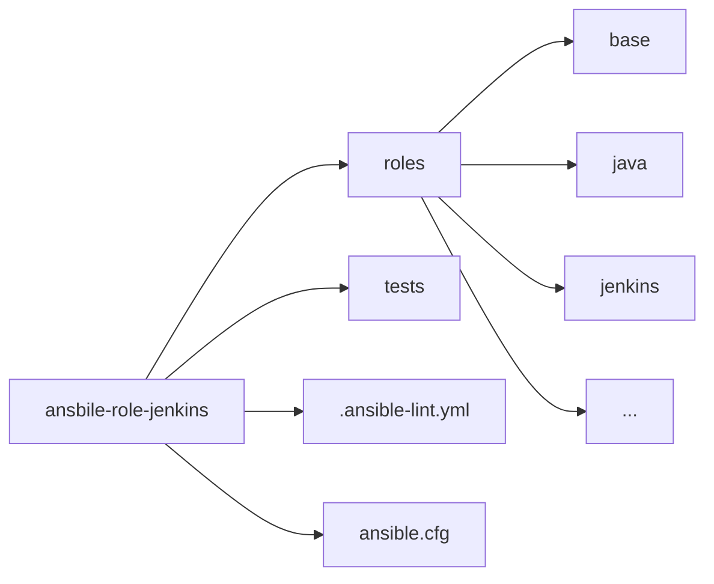
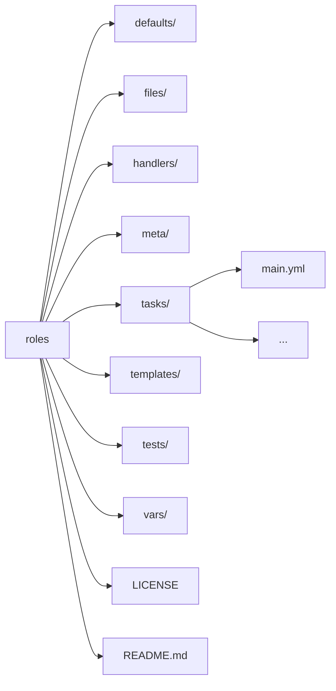

Jenkins CI/CD Server Setup
=========

This Ansible Role automates the setup and configuration of a Jenkins server on an Ubuntu machine. It installs and configures various components required for a fully operational CI/CD environment.

Requirements
------------

- Ansible 2.16 or higher installed on the control node.
- An Ubuntu server with `sudo` privileges and ssh server enabled.

> [!TIP]
> For local tests, you may use the `tests/docker-compose.yml` file to start a Ubuntu 24.04 container.

How to Use
------------
Configure Jenkins Standalone
1. Clone this repository to your Ansible roles directory:
    ```bash
    git clone https://github.com/Innovate-Future-Foundation/ansible-role-jenkins.git ansible-role-jenkins
    ```

2. Export environment varibale
    ```bash
    export ANSIBLE_CONFIG=$PWD/ansible.cfg
    ```
    Execute under the project root directory. This tells ansible where to find the roles.

3. Update the `inventory-standalone.yml` file:
    ```yml
    all:
      children:
        master:
          hosts:
            master-node:
              ansible_host: localhost
              ansible_host_alias: jenkins-master
              ansible_user: root
              ansible_port: 23
              ansible_ssh_private_key_file: ~/.ssh/id_rsa
              ansible_ssh_extra_args: '-o StrictHostKeyChecking=no'
    ```
    Replace the ssh connection details.

    For detailed inventory file configurations, see [Ansible doc](https://docs.ansible.com/ansible/latest/inventory_guide/intro_inventory.html#how-to-build-your-inventory).

4. Run the playbook:
    ```bash
    ansible-playbook -i inventory-standalone.yml playbook-standalone.yml
    ```

Configure Jenkins Cluster
1. Clone this repository to your Ansible roles directory:
    ```bash
    git clone https://github.com/Innovate-Future-Foundation/ansible-role-jenkins.git ansible-role-jenkins
    ```

2. Export environment varibale
    ```bash
    export ANSIBLE_CONFIG=$PWD/ansible.cfg
    ```
    Execute under the project root directory. This tells ansible where to find the roles.

3. Update the `inventory-standalone.yml` file:
    ```yml
    all:
      children:
        master:
          hosts:
            master-node:
              ansible_host: localhost
              ansible_host_alias: jenkins-master
              ansible_user: root
              ansible_port: 23
              ansible_ssh_private_key_file: ~/.ssh/id_rsa
              ansible_ssh_extra_args: '-o StrictHostKeyChecking=no'
        worker:
          hosts:
            worker-1-node:
              ansible_host: localhost
              ansible_host_alias: jenkins-worker1
              ansible_user: root
              ansible_port: 24
              ansible_ssh_private_key_file: ~/.ssh/id_rsa
              ansible_ssh_extra_args: '-o StrictHostKeyChecking=no'
              roles: ['aws-cli', 'nodejs']
            worker-2-node:
              ansible_host: localhost
              ansible_host_alias: jenkins-worker2
              ansible_user: root
              ansible_port: 25
              ansible_ssh_private_key_file: ~/.ssh/id_rsa
              ansible_ssh_extra_args: '-o StrictHostKeyChecking=no'
              roles: ['aws-cli', 'dotnet', 'dotnet-ef', 'docker-cli']
    ```
    Replace the ssh connection details.

    For detailed inventory file configurations, see [Ansible doc](https://docs.ansible.com/ansible/latest/inventory_guide/intro_inventory.html#how-to-build-your-inventory).

4. Run the playbook:
    ```bash
    ansible-playbook -i inventory-cluster.yml playbook-cluster.yml
    ```

File Structure
------------


Directories
------------
The following is a breakdown of the key files and directories in this role:

- **`roles/`**: Contains the flexibility roles for configuring Jenkins server.
- **`tests/`**: Integration tests for combined roles.
- **`.ansible-lint.yml`**: Contains `ansible-lint` configurations. Use below command to run lint
  ```shell
  ansible-lint -c .ansible-lint.yml
  ```
- **`ansible.cfg`**: Ansible Configuration Settings file, see [Ansible doc](https://docs.ansible.com/ansible/latest/reference_appendices/config.html#ansible-configuration-settings). Configure environment variable using the below command or you can also configure in OS profile or user profile.
  ```shell
  export ANSIBLE_CONFIG=/path/to/your/ansible.cfg
  ```

Role Directories
------------

The following is a breakdown of the key files and directories in this role:

- **`defaults/`**: Contains default variables used in the role.
- **`files/`**: Includes static files required for configuration.
- **`handlers/`**: Contains handlers triggered by task notifications, such as restarting services.
- **`meta/`**: Defines metadata about the role, such as dependencies.
- **`tasks/`**: This directory is the heart of the Ansible role, containing the primary logic that defines the sequence of actions to be executed. It typically includes a main.yml file, which serves as the entry point for task execution. Tasks in this directory can perform a variety of operations, such as installing packages, configuring services, managing files, and more.
- **`templates/`**: Stores Jinja2 templates for dynamic file generation.
- **`tests/`**: Includes test playbooks for validating the role.
- **`vars/`**: Contains role-specific variables.

For each role, you can use the below command to create the file structure.
```shell
ansible-galaxy init [role_name]
```

Role Variables
--------------

A description of the settable variables for this role should go here, including any variables that are in defaults/main.yml, vars/main.yml, and any variables that can/should be set via parameters to the role. Any variables that are read from other roles and/or the global scope (ie. hostvars, group vars, etc.) should be mentioned here as well.

Role Planning
--------------
The followings are the planned roles needed for this project:
- [x] **`base`**: Configures OS level settings. Installs dependency software.
- [x] **`java`**: Installs the OpenJDK according to selected version.
- [x] **`jenkins`**: Installs Jenkins service. Configure Jenkins. Install Jenkins plugins.
- [ ] **`certibot`**: Installs certibot, configure self-signed certificate.
- [ ] **`nginx`**: Installs Nginx service, configure Nginx to expose secure HTTPS port, proxy for backend Jenkins service.
- [x] **`aws-cli`**: Installs aws-cli for manipulating AWS resources.
- [x] **`docker-cli`**: Installs docker-cli to build docker images.
- [x] **`nodejs`**: Installs Node.js for frontend code build environment.
- [x] **`dotnet`**: Installs DotNet for backend code build environment.
- [x] **`dotnet-ef`**: Installs DotNet Entity Framework tool for database migration.

Dependencies
------------

A list of other roles hosted on Galaxy should go here, plus any details in regards to parameters that may need to be set for other roles, or variables that are used from other roles.

Example Playbook
----------------

Below is an example of how to use your role:
```yaml
- name: Install Jenkins
  hosts: test
  become: yes
  vars:
    jdk_version: openjdk-21
  roles:
    - role: base
    - role: java
    - role: jenkins
```
In the example, defined an override variable `jdk_version` passed to the java role task.

In the provided playbook, the roles and their respective tasks perform the following:
- `base`: Sets up essential system configurations and ensures the environment is ready for further installations.
- `java`: Installs the specified version of JDK (openjdk-21) and ensures the system's Java environment is properly configured.
- `jenkins`: Installs Jenkins, configures its dependencies, and ensures the service is running.

License
-------

This role is licensed under the Apache 2.0 License. See the `LICENSE` file for details.

Contributors
------------------

Developed by:
- [Mark](https://github.com/markma85)
- [Henry](https://github.com/henry22)

Contributions are welcome!
